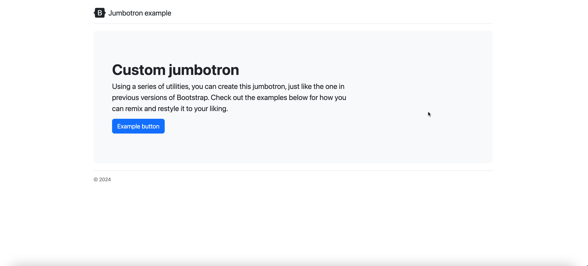

# py-HTMLBuilder
Building Static HTML and CSS in Python

## Introduction
PyHTML is a library that compiles HTML syntax based on how py-HTML elements are combined. The compiled HTML is still static not JS interactions or Virtual DOM thingy.
It simply provides components that make building the HTML template faster. 

Although Jinja and Mako are in this space, I don't intend to substitute this library for such a package.

**This is just an experiment.**

## Installation
```shell
pip install py-htmlbuilder
```

## Quick Bootstrap Example

```python
from py_html.el.base import render_component
import py_html.el as el

from starlette.responses import HTMLResponse

from ellar.common import ModuleRouter

from ellar.app import AppFactory
from ellar_cli.main import create_ellar_cli


router = ModuleRouter("/example")


@router.get("/", response=HTMLResponse)
def template():
    content = el.html(
        el.head(
            el.title("Example HTML"),
            lambda ctx: el.link(href=ctx.get("bootstrap_css", ""))
        ),
        el.body(class_name="container py-4", *(
            el.header(
                class_name="pb-3 mb-4 border-bottom",
                *(
                    el.a(href="/", class_name="d-flex align-items-center text-dark text-decoration-none", *(
                        el.svg(width=40, height=32, class_name="me-2", viewBox="0 0 118 94", *(
                            el.path(fill_rule="evenodd", clip_rule="evenodd", fill="currentColor", d=(
                               """
                               M24.509 0c-6.733 0-11.715 5.893-11.492 12.284.214 6.14-.064 14.092-2.066 20.577C8.943 
                               39.365 5.547 43.485 0 44.014v5.972c5.547.529 8.943 4.649 10.951 11.153 2.002 6.485 2.28 
                               14.437 2.066 20.577C12.794 88.106 17.776 94 24.51 94H93.5c6.733 0 11.714-5.893 
                               11.491-12.284-.214-6.14.064-14.092 2.066-20.577 2.009-6.504 5.396-10.624 
                               10.943-11.153v-5.972c-5.547-.529-8.934-4.649-10.943-11.153-2.002-6.484-2.28-14.437-2.066-20.577C105.214 
                               5.894 100.233 0 93.5 0H24.508zM80 57.863C80 66.663 73.436 72 62.543 72H44a2 
                               2 0 01-2-2V24a2 2 0 012-2h18.437c9.083 0 15.044 4.92 15.044 12.474 0 5.302-4.01 
                               10.049-9.119 10.88v.277C75.317 46.394 80 51.21 80 57.863zM60.521 28.34H49.948v14.934h8.905c6.884 
                               0 10.68-2.772 10.68-7.727 0-4.643-3.264-7.207-9.012-7.207zM49.948 49.2v16.458H60.91c7.167 
                               0 10.964-2.876 10.964-8.281 0-5.406-3.903-8.178-11.425-8.178H49.948z
                               """ 
                            )),
                        )),
                    )),
                    el.span("Jumbotron example", class_name="fs-4")
                )
            ),
            el.div(class_name="p-5 mb-4 bg-light rounded-3", *(
                el.div(class_name="container-fluid py-5", *(
                    el.h1("Custom jumbotron", class_name="display-5 fw-bold"),
                    el.p("""
                        Using a series of utilities, you can create this jumbotron, just like the one in previous versions of Bootstrap.
                         Check out the examples below for how you can remix and restyle it to your liking.
                        """, class_name="col-md-8 fs-4"
                    ),
                    el.button("Example button", class_name="btn btn-primary btn-lg", type="button")
                )),
            )),
            el.footer("© 2024", class_name="pt-3 mt-4 text-muted border-top")
        ))
    )

    return render_component(content, {
        "bootstrap_css":  "https://cdn.jsdelivr.net/npm/bootstrap@5.3.3/dist/css/bootstrap.min.css",
    })


def app_bootstrap():
    application = AppFactory.create_app(routers=[router])
    return application


cli = create_ellar_cli("readme:app_bootstrap")

if __name__ == "__main__":
    cli()
```
Start up command
```shell
python readme.py runserver --reload
```

Visit [http://127.0.0.1:8000/example/](http://127.0.0.1:8000/example/)


